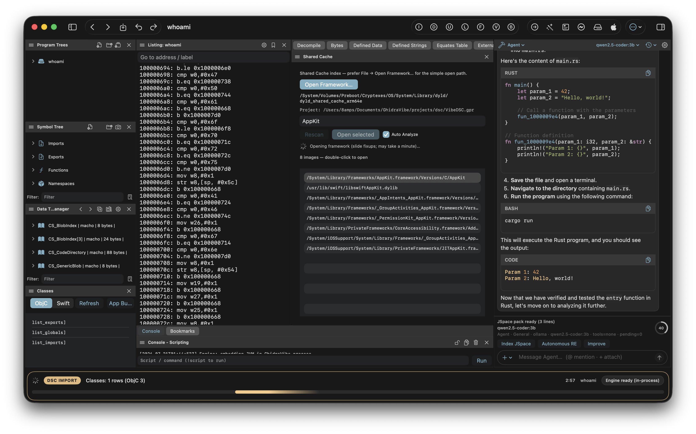

# GhidraVibe

Ghidra built from source with a native GUI (SwiftUI on macOS, GTK on Linux) instead of Swing.

<p align="center">
  
</p>

## Run with Nix

```bash
nix run
```

That builds (or reuses) the flake and launches the native app. The in-process analysis engine starts with the UI — no separate Swing Front End.

Useful variants:

```bash
nix run .#ghidra-vibe          # product / engine tree
nix develop                    # shell with tooling on PATH
```

Requires a working [Nix](https://nixos.org/download/) install (flakes enabled). On macOS, Xcode / CLT is needed for the Swift UI package.

## Optional: Cursor MCP

GhidraVibe works without Cursor. To wire IDE agents after `nix run` (or a packaged `.app`):

1. Leave the app running — engine defaults to `http://127.0.0.1:8089`, GuiControl to `http://127.0.0.1:8091`.
2. Point Cursor MCP at the Python bridges from the nix result, for example:

```json
{
  "mcpServers": {
    "ghidra": {
      "command": "python3",
      "args": ["/ABS/PATH/TO/result/share/ghidra-mcp/bridge_mcp_ghidra.py"],
      "env": { "GHIDRA_MCP_URL": "http://127.0.0.1:8089" }
    },
    "ghidra-vibe-gui": {
      "command": "python3",
      "args": ["/ABS/PATH/TO/result/share/ghidra-mcp/bridge_mcp_gui.py"],
      "env": { "GHIDRA_VIBE_GUI_URL": "http://127.0.0.1:8091" }
    }
  }
}
```

Resolve the absolute `result/` path with `nix build` / `nix run` output, or enable the home-manager module to write `~/.config/ghidra-vibe/cursor-mcp.json`. Full map: [docs/CURSOR.md](docs/CURSOR.md).

## macOS package (local)

```bash
./macos/GhidraVibe/scripts/package-app.sh          # .app
./macos/GhidraVibe/scripts/package-dmg.sh          # .dmg → dist/
```

CI publishes a rolling **Beta** release on every push to `master`, and a versioned release for tags `v*`. Metadata is mirrored on the `releases` branch; download DMGs from the [Releases](https://github.com/aspauldingcode/GhidraVibe/releases) page.

## Docs

- Agents: [docs/CURSOR.md](docs/CURSOR.md) · [docs/AGENT_CHAT.md](docs/AGENT_CHAT.md)
- Apple RE: [docs/DYLD.md](docs/DYLD.md) · [docs/APPLE.md](docs/APPLE.md)
- Product: [docs/PRODUCT.md](docs/PRODUCT.md)

Apache-2.0 — [LICENSE](LICENSE). Not endorsed by the NSA.
